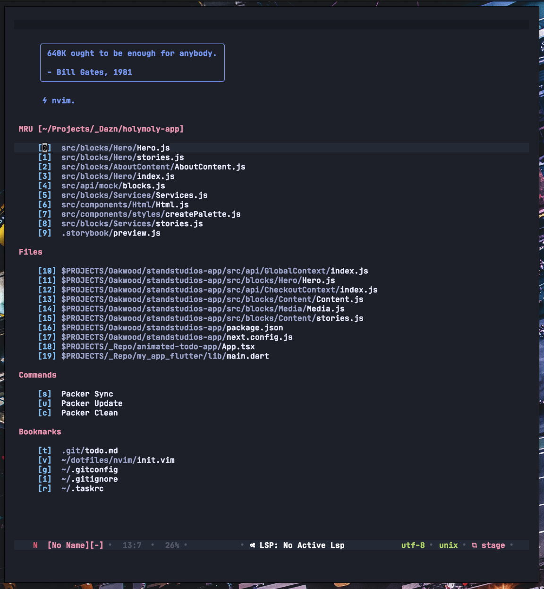
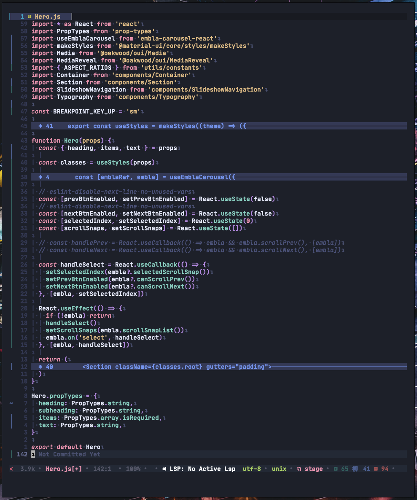
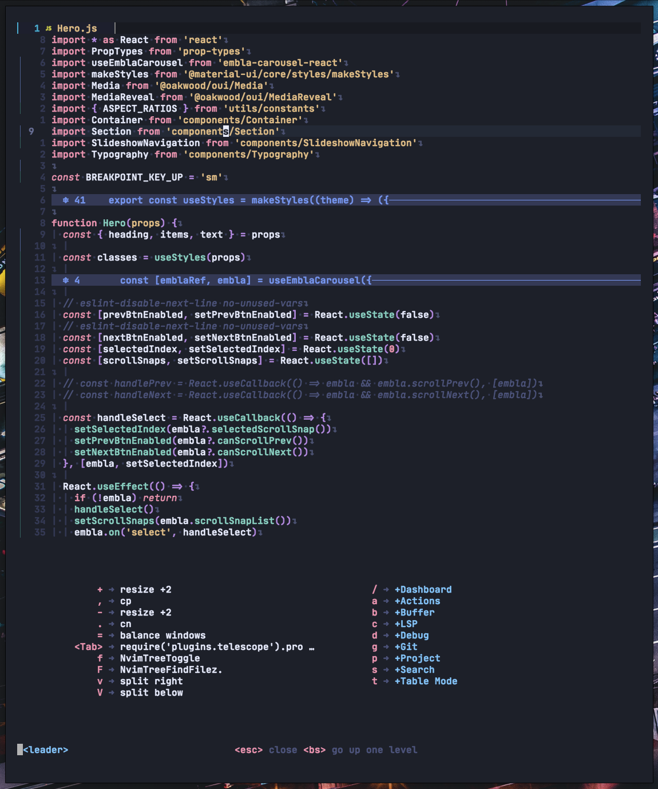
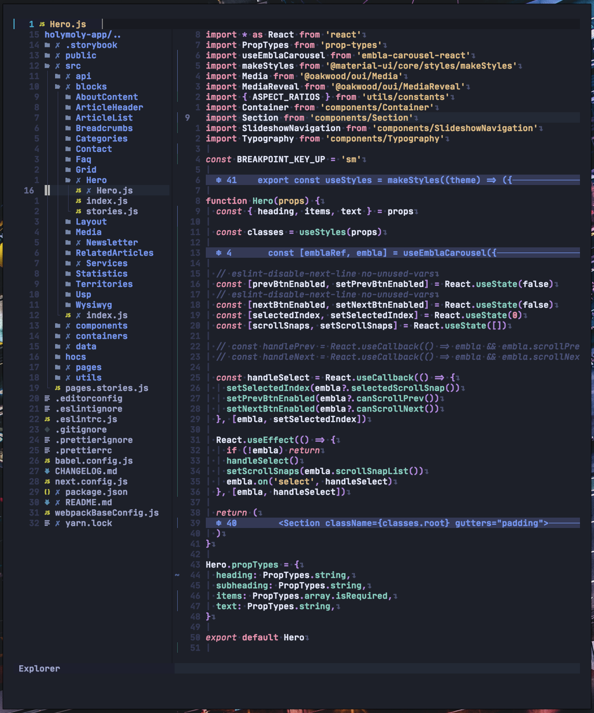

# Aylin 🌌

<p align="center">
  
</p>

<p align="center">
    <em>Aylin is a modern and minimal VIM dark theme with bright colors. The theme is based on the great theme <a href="https://github.com/ayu-theme/vscode-ayu">Ayu theme</a>. See Credits for a detailed lineage.</em>
</p>



|  |  |  |
| ----------------------------------------------------------------------------------------------------------------------- | ------------------------------------------------------------------------------------------------------------------------ | ------------------------------------------------------------------------------------------------------------------------ |

## ✨ Features

- supports the latest Neovim 5.0 features like TreeSitter and LSP
- minimal inactive statusline
- vim terminal colors
- darker background for sidebar-like windows
- color configs for [Kitty](https://sw.kovidgoyal.net/kitty/conf.html?highlight=include), [Alacritty](https://github.com/alacritty/alacritty) and [Fish Shell](https://fishshell.com/)
- **lualine** theme

### Plugin Support

- [TreeSitter](https://github.com/nvim-treesitter/nvim-treesitter)
- [LSP Diagnostics](https://neovim.io/doc/user/lsp.html)
- [LSP Trouble](https://github.com/folke/lsp-trouble.nvim)
- [LSP Saga](https://github.com/glepnir/lspsaga.nvim)
- [Git Signs](https://github.com/lewis6991/gitsigns.nvim)
- [Git Gutter](https://github.com/airblade/vim-gitgutter)
- [Telescope](https://github.com/nvim-telescope/telescope.nvim)
- [NvimTree](https://github.com/kyazdani42/nvim-tree.lua)
- [WhichKey](https://github.com/liuchengxu/vim-which-key)
- [Indent Blankline](https://github.com/lukas-reineke/indent-blankline.nvim)
- [Dashboard](https://github.com/glepnir/dashboard-nvim)
- [BufferLine](https://github.com/akinsho/nvim-bufferline.lua)
- [Lualine](https://github.com/hoob3rt/lualine.nvim)
- [Lightline](https://github.com/itchyny/lightline.vim)
- [Neogit](https://github.com/TimUntersberger/neogit)
- [vim-sneak](https://github.com/justinmk/vim-sneak)
- [Fern](https://github.com/lambdalisue/fern.vim)
- [Barbar](https://github.com/romgrk/barbar.nvim)

## ⚡️ Requirements

- Neovim >= 0.5.0

## Installation
You can install `aylin.vim` with whatever package manager you use:

[packer](https://github.com/wbthomason/packer.nvim)

```lua
use 'AhmedAbdulrahman/aylin.vim'
```

[vim-plug](https://github.com/junegunn/vim-plug)
```vim
Plug 'AhmedAbdulrahman/aylin.vim', { 'branch': '0.5-nvim' }
```

## 🚀 Usage

Enable the colorscheme:

```vim
" Vim Script
colorscheme aylin
```

```lua
-- Lua
vim.cmd[[colorscheme aylin]]
```

To enable the `Aylin` theme for `Lualine`, simply specify it in your lualine settings:

```lua
require('lualine').setup {
  options = {
    -- ... your lualine config
    theme = 'aylin'
    -- ... your lualine config
  }
}
```

To enable the `aylin` colorscheme for `Lightline`:

```vim
" Vim Script
let g:lightline = {'colorscheme': 'aylin'}
```
## Contributing
All forms of contribution are welcome: bug reports, bug fixes, pull requests and simple suggestions. Thanks!


## Credits

Credit goes to the [Ayu theme][vscodeayu]. I ended up changing colors and their mappings.

## License
MIT License © 2020 Ahmed Abdulrahman. See [LICENSE.txt](./LICENSE.txt) for more information.

[logo]: images/logo.png
[screenshot]: images/screenshot.png
[vscodeayu]: https://github.com/ayu-theme/vscode-ayu
[vimplug]: https://github.com/junegunn/vim-plug
[neobundle]: https://github.com/Shougo/neobundle.vim
[vundle]: https://github.com/gmarik/vundle
[vimpathogen]: https://github.com/tpope/vim-pathogen
[firaCode]: https://github.com/tonsky/FiraCode
