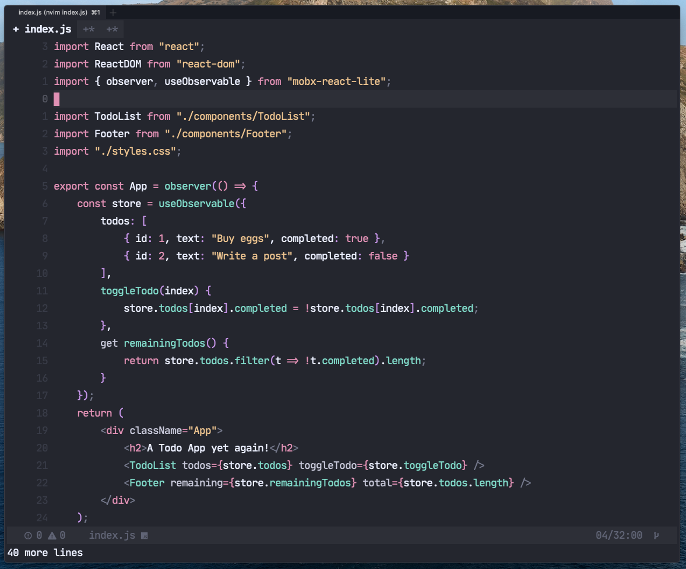

# Aylin 🌌

<p align="center">
  
</p>

<p align="center">
    <em>Aylin is a modern and minimal VIM dark theme with bright colors. The theme is based on the great theme <a href="https://github.com/ayu-theme/vscode-ayu">Ayu theme</a>. See Credits for a detailed lineage.</em>
</p>

> If you want to use this plugin with Neovim 0.5, please use the [**0.5-nvim**](https://github.com/AhmedAbdulrahman/aylin.vim/tree/0.5-nvim) branch

<p align="center">
  
</p>

## Installation
You can install `aylin.vim` with whatever package manager you use. For example:
- [Pathogen][vimpathogen]
- [Vundle][vundle]
- [NeoBundle][neobundle]
- [VIM Plug][vimplug]

For example:

- Pathogen
  - `git clone https://github.com/AhmedAbdulrahman/vim-aylin.git ~/.vim/bundle/vim-aylin`
- Vundle
  - Add `Plugin 'AhmedAbdulrahman/vim-aylin'` to your .vimrc and run `:PluginInstall`
- NeoBundle
  - Add `NeoBundle 'AhmedAbdulrahman/vim-aylin'` to your .vimrc and run `:NeoBundleInstall`
- vim-plug
  - Add `Plug 'AhmedAbdulrahman/vim-aylin'` to your .vimrc and run `:PlugInstall`
- Vim-8
  - `git clone https://github.com/AhmedAbdulrahman/vim-aylin.git ~/.vim/pack/default/start/vim-aylin`

>> If you don't use a plugin manager just copy the content of vim/colors/ to ~/.vim/colors.

## Usage
In your Vim `(~/.vimrc)` or Neovim `(.config/nvim/init.vim)` configuration, place the following two lines:

```vim
set background=dark
colorscheme aylin
```

### True Colors

To provide the best user experience possible, I recommend enabling true colors. To experience the blissfulness of your editor's true colors, place this in your `.vimrc` or `~/.config/nvim/init.vim` file:

```vim
if (has("nvim"))
  "For Neovim 0.1.3 and 0.1.4 < https://github.com/neovim/neovim/pull/2198 >
  let $NVIM_TUI_ENABLE_TRUE_COLOR=1
endif

"For Neovim > 0.1.5 and Vim > patch 7.4.1799 < https://github.com/vim/vim/commit/61be73bb0f965a895bfb064ea3e55476ac175162 >
"Based on Vim patch 7.4.1770 (`guicolors` option) < https://github.com/vim/vim/commit/8a633e3427b47286869aa4b96f2bfc1fe65b25cd >
" < https://github.com/neovim/neovim/wiki/Following-HEAD#20160511 >
if (has("termguicolors"))
  set termguicolors
endif
```

### Vim Lightline
To use the included [lightline.vim](https://github.com/itchyny/lightline.vim) theme:

```vim
let g:lightline = {
      \ 'colorscheme': 'aylin',
      \ }
```

## Contributing
All forms of contribution are welcome: bug reports, bug fixes, pull requests and simple suggestions. Thanks!


## Credits

Credit goes to the [Ayu theme][vscodeayu]. I ended up changing colors and their mappings.

## License
MIT License © 2020 Ahmed Abdulrahman. See [LICENSE.txt](./LICENSE.txt) for more information.

[logo]: images/logo.png
[screenshot]: images/screenshot.png
[vscodeayu]: https://github.com/ayu-theme/vscode-ayu
[vimplug]: https://github.com/junegunn/vim-plug
[neobundle]: https://github.com/Shougo/neobundle.vim
[vundle]: https://github.com/gmarik/vundle
[vimpathogen]: https://github.com/tpope/vim-pathogen
[firaCode]: https://github.com/tonsky/FiraCode
